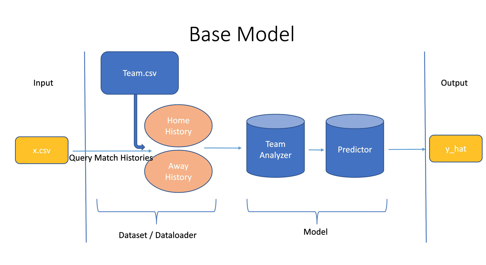
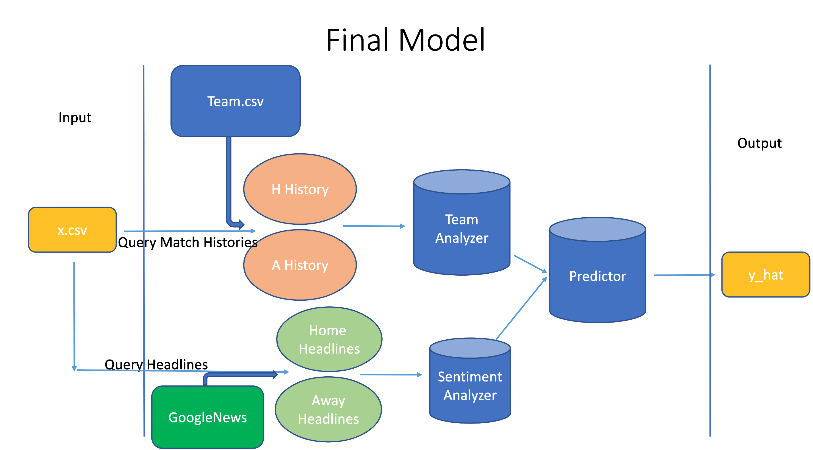

# Introduction

Soccer is estimated to be the most popular sport in the world, with
billions of fans worldwide, and a large market for gambling. For
recreational and economic reasons, a predictive model for the outcome of
a soccer match can be very interesting and useful. Additionally, as more
advanced technology is integrated into every industry, including sports
and soccer, machine learning models can uncover new understandings of
the game. Practically, there will be many fields in which the model can
be applied to if our model can achieve high accuracy.

We have created a deep learning model to predict the outcomes of Premier
League soccer matches. It uses statistics about teams and players to
predict whether the home team will win (Home Win), Tie (Draw) or whether
the home team will lose (Home Loss) to the away team.

There have been several similar previous attempts of implementing other
machine learning models to predict the outcomes of other
leagues/competitions. However, many of the previous attempts used either
outdated datasets, or simple model structures or simple recurrent or
convolutional networks. Our model is architecturally more complex, in
addition to being a deep neural network. Our model input was also
augmented with sentiment data from Google News about both teams involved
in each match, which has not been done before.

Our hypothesis is that the Augmented Model (using the sentiment data
from Google News) will have better accuracy than the Base Model (without
sentiment data from Google News.) This is because the sentiment data can
hopefully capture non-statistical yet significant features for game
result predictions, such as form, injuries, and suspensions, etc. We
evaluated the success of our hypothesis by comparing model accuracy on
the test set.

The Base Model’s input consists entirely of soccer data and statistics
on Premier League teams scraped and gathered from Wyscout. Wyscout is a
professional soccer data analysis platform, which has been widely used
by club staff, agents, and scouts, and provided us with 109 columns of
data per team per game.

The Augmented Model’s input is the same as the Base Model, in addition
to headlines from GoogleNews about each team for each game.

This is a supervised classification problem, where the output of both
models is the same, probabilities for each class (Home Win, Draw, Home
Loss) and a prediction (the class with the highest value). Our model was
evaluated with cross-entropy loss and accuracy.

# Related Work

There have been several papers and projects that have attempted to
create Machine Learning models for soccer match prediction. Most of them
focus on data collection, which seems to be a difficult problem at the
time of their publication, with relatively simple models. These studies
typically incorporate machine learning technologies and model the
problem as a classification task, with the help of previous match data
of each club or individual being an indication.

The best accuracy benchmark we have seen for this problem from the
related work was 63.3% in predicting 2018 FIFA World Cup matches , which
used a recurrent (LSTM) model. It also used match results back from the
19th century, and they used the FIFA points ranking system as the major
model inputs to make their predictions, not any detailed data or
statistics about teams or players.

Also, a lot of models avoided digging through specific data of teams and
players by focusing on larger, aggregate data, like this one by Groll et
al . They try many different kinds of data, like FIFA rankings,
GDP/population of each country, historic match results, bookmakers data,
and plus/minus of each player. Still, they never use specific game
statistics that actually inform match outcomes.

Looking at these previous works, most of them weren’t capable of using
data available on a similar level as ours, and most of the works were
conducted several years ago when there wasn’t as much deep learning
knowledge available/created in the field. We will use some of their data
pre-processing techniques, but we surely plan to expand on some of these
previous models by involving a more comprehensive dataset, updating
these into more complex and modern architectures, and introducing the
non-statistical information, captured by the sentiment data from
twitter, into the model.

# Method

This problem is a supervised classification task.

The input to the Base Model is *X* ∈ ℝ*N* × 2 × *K* × *D*,
where *N* is batch size, 2 represents the two teams that play in each
match (home and away), *K* is length of match history, *D* is the number
of features (106 in the case of our model.)

The length of match history refers to the number of games to be used
before the game to predicted. For example, let the game to be predicted
be Home Team A vs. Away Team B on Date d, and *K* = 10. Then this
model’s input, *X* ∈ ℝ1 × 2 × 10 × 106, for each team,
includes the last 10 matches of data before Date *d*.

The input to the Augmented Model includes *X*, as well as
*X*′ ∈ ℝ*N* × 2 × *L*, where *N* still represents batch size,
as 2 is for the number of teams, and *L* denotes the number of headlines
from Google News used to encode sentiment for each team.

The output of the model is *O* ∈ ℝ3, representing the three
output classes, Home Win, Draw, or Home Loss.

## Data Collection and Processing

The data we started with was a collection of .xlsx files downloaded from
Wyscout. Each file represented one team’s data from one season. Since
there are 20 teams in the Premier League each year, and we downloaded
data from the 2018 - 2019 season to the 2022 - 2023 season, we had 100
excel files.

First, we concatenated files from the same team, leaving us with 27
files. The reason why we didn’t have 20 files is because 3 teams change
between seasons in the Premier League (promotion and relegation.)

We then processed and cleaned the data in each file. Each row represents
one team’s statistics per game, thus there are two rows corresponding to
statistics from one game. Unnecessary columns were removed (such as
"Competition" which was always "Premier League",) important columns were
added ("Win", "Score",) and other important processing was done, such as
mapping the "Scheme" column (strings representing team formation:
’4-2-3-1’, ’5-3-2’, etc.) to integers.

We then ended up with .csv files with data for each team, at this point
with 106 features.

However, our ’x.csv’, the file read by the Dataloader, contained only 3
features: ’Home Team’, ’Away Team’, ’Date’, corresponding to one game,
which are the enough features to uniquely identify a game. Our ’y.csv’
contained the correct label for each game.

## Dataset

The Dataset class uses a list of these game representations: (Home Team,
Away Team, Date), and uses the hyperparameter K to query the larger .csv
files of data for the model input,
*X* ∈ ℝ*N* × 2 × *K* × *D*. While this takes longer than it
would take to store this data directly, we made this decision to only
store data in *O*(*M*) space, where *M* is the number of games we have
data for, instead of *O*(*M**K*) space, where *K* is a variable
hyperparameter.

For our Augmented Model we also had to retrieve data from Google News
about each game. The input remained the same (Home Team, Away Team,
Date), and we wrote a wrapper class, GoogleNews, that the Dataset
interfaced with in order to easily search *L* relevant headlines in a
given date range given some search text.

## Model

The overall model consists of three major parts: the Team Analyzer, the
Predictor and the Sentiment Analyzer. We call the model with only Team
Analyzer and Predictor the Base Model, and the full model the Augmented
Model as news sentiment information serves as the augmentation of
original data.

### Team Analyzer

With the intuition that previous matches’ data describe the form and
tactical ability of a team, the model’s input takes the most recent *K*
game records before the date of the game to be predicted as the
indication of the team’s in-game ability. The first part of the model is
a public team analyzer that analyzes this ability for each team and
encodes the ability into a vector. Considering the previous *K* match
records can be formulated as a sequence naturally, this analyzer is
implemented with *L**S**T**M* that maps *R**N* × *K* × *D*
into *R**N* × *F*, where *F* is the dimension of our team
feature vector and *N* is the batch size.

In general, the hyperparameters for this part of the model were *K*,
num_layers of the recurrent network, and the feature_size.

### Predictor

The predictor evaluates the in-game ability vectors of the given two
teams and outputs the game predictions, which is a function:
$R^{N \\times 2 \\times F} \\xrightarrow{}R^{3}$. Since most analysis is
carried out by the analyzer parts, we implement the predictor with dense
layers of hidden size 128 and depth of 22.

### Sentiment Analyzer

As an augmentation of the base model, we also introduced a public
sentiment analyzer that evaluates online scraped news data of each team.
Specifically, it has an embedding layer that embeds the headlines using
pre-trained GloVe model with 50-dimension , followed by an LSTM to
encode the sentiment of the news about the team. The encoded sentiment
vectors are then fused with the encoded team data (from the Team
Analyzer,) in order to create a rich sentiment representation of each
team, which are then passed to the Predictor with the same architecture.

# Experiments

In the initial Base Model, both the Team Analyzer and Predictor were
feedforward networks. We achieved a best test accuracy of 80%, which was
extremely high, much higher any models from previous studies. The
hyperparameters we used for our best model were *K* = 10, feature_size =
128, hidden_size1 = 256, hidden_size2 = 128. We used 10 hidden layers in
the Team Analyzer, 12 hidden layers in the Predictor. Later when
switching to a convolutional neural network, we did not achieve very
good results.

After investigation, we realized that this model likely had very high
accuracy because of bias. We randomly partitioned matches into the
training, validation, and test sets, but since the model looks at *K*
previous matches from each team for each match, there was overlap
between the three different sets we were using. This conclusion was
likely correct, as after we separated our training and test sets
chronologically, the accuracy fell to 60.1% We then tried replacing the
feedforward network in in the Team Analyzer with a *G**R**U*, and our
first experiment with num_layers = 4, feature_size = 128 gave us
slightly better test accuracy: 61.6%.

The following table shows different hyperparameter settings for the Team
Analyzer that we tried, and their associated test accuracy on the Base
Model:

| Type | Num Layers | Feature Size |  K  | Accuracy |
|:----:|:----------:|:------------:|:---:|:--------:|
| GRU  |     4      |     128      | 10  |  0.616   |
| GRU  |     4      |     256      |  6  |  0.538   |
| GRU  |     4      |      64      | 10  |  0.612   |
| GRU  |     6      |     256      | 15  |  0.560   |
| GRU  |     6      |     128      | 10  |  0.607   |
| LSTM |     6      |     128      | 10  |  0.623   |
| LSTM |     4      |     128      | 10  |  0.604   |
| LSTM |     6      |     256      | 10  |  0.644   |

We carried out two experiments to test our work for Augmented Model. The
first version of the experiment tested the Augmented Model’s ability as
a completely new model without pre-training attempt. And we also adopted
Transfer Learning that freezes the Team Analyzer part of an Augmented
Model instance, with the Team Analyzer directly inherited from the best
Base Model.

In the plain experiment of Augmented Model, we summarized the hyper
parameters and the eventual performance into this table below.

| Type | Num Layers | Feature Size |  K  | Accuracy |
|:----:|:----------:|:------------:|:---:|:--------:|
| GRU  |     4      |     128      | 10  |  0.596   |
| LSTM |     6      |     128      | 10  |  0.584   |
| LSTM |     6      |     256      | 10  |  0.613   |

In the transfer learning experiment, the Sentiment Analyzer served as
just an augmentation to the Base Model since the Team Analyzer was
considered well-trained and frozen. We expected higher training speed
due to the reduced optimization difficulty but were curious about
whether this attempt would help improve its performance. The following
table summarizes hyperparameter settings for the Sentiment Analyzer.

| Type | Num Layers | Feature Size |  L  | Accuracy |
|:----:|:----------:|:------------:|:---:|:--------:|
| LSTM |     4      |     256      | 10  |  0.652   |
| LSTM |     4      |     256      | 10  |  0.638   |
| LSTM |     6      |     256      | 10  |  0.602   |

We used the model from the last row of the first table for transfer
learning. This immediately achieved better performance. It started off
with a much higher validation accuracy: 57.2%, where previously we had
started off with validation accuracy 20% − 40%. Its testing accuracy was
also highest: 65.2%.

## Result Analysis

These results show that we have been able to achieve very reasonable
accuracy using deep neural networks to predict the outcome of Premier
League soccer matches. Additionally, our hypothesis was correct in that
the Augmented Model achieved better testing accuracy than our Base
Model, though not by that much.

Using transfer learning it would likely be difficult to get lower
accuracy in the augmented model than the base model. However, we have
achieved slightly greater accuracy, which is the highest we have seen in
any predictive model for soccer matches.

It is possible that the sentiment data from Google News does not have
much do with the increase in accuracy, and training the Augmented Model
just allowed for more optimization of the Predictor. However, we
attempted to tune the Base Model with many epochs and many
hyperparameters, and achieved the highest accuracy on the first attempt
of the Augmented Model, so it appears that the sentiment data did have
an actual positive effect on the accuracy of the model.

Therefore, we conclude that our hypothesis was correct.

# Conclusion

Based on the results we had from the previous section, since the
Augmented Model yielded a higher accuracy than the Base model, we were
able to prove our original hypothesis that adding sentiment analysis
would improve accuracy prediction. Since the difference between the Base
model and the Augmented Model is within an insignificant range, we
weren’t able to conclude strongly how much improvement adding sentiment
analysis would help.

Another thing to note is that our best test accuracy is higher than most
of the studies we could find online, while we built our model in a
limited period of time and with restricted data access. Therefore, there
are some areas that could potentially makes the model better. For
instance, a dataset with more games available, new match statistics
updated automatically, and more competitions/leagues available would
help future studies. Also, access to Twitter Academic Research would
potential improve the Sentiment Analyzer part. Our current Sentiment
Analyzer that fetches the headlines of Google news by fetching the team
name in a certain time range could introduce less non-statistical
information we wish to put into the model. For example, when we searched
"Brighton" for Brighton & Hove Albion, a team in the Premier League,
news about City Brighton in both UK and the U.S. got fetched in with the
headlines about the soccer team.

Another important conclusion is that utilizing transfer learning greatly
increased the accuracy of our Augmented Model.
